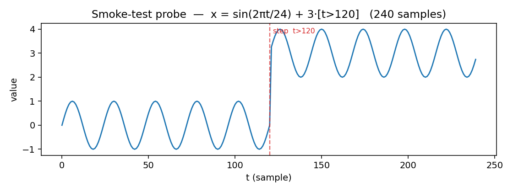

# SUMMARY — native time-series LLM smoke tests

**Hardware:** Apple M1 Max (arm64), 64 GB RAM, **no CUDA GPU** (`nvidia-smi` absent) →
all inference on **CPU** (MPS crashed or is unsupported; details in per-model reports).
**Test series:** 240 pts (600 for ITFormer), sinusoid + sharp sustained step at the
midpoint — `x = sin(2πt/24) + 3·[t>120]`. A correct description must mention **both** the
periodic oscillation **and** the step.

| model | installed | inference ok | inference time (CPU) | output correctly describes the series (periodicity + step)? |
|---|---|---|---|---|
| **ChatTime** (7B, `ChengsenWang/ChatTime-1-7B-Chat`) | yes | yes — `predict()` → ndarray(24,) on CPU retry (first byte-exact attempt SIGBUS'ed loading fp16 on MPS) | 502 s total incl. load; QA: TSQA 436 s, free-form 42 s | **NO** — free-form description unsupported: degenerates to serialized value continuation (`###0.2693### …`), zero words. The `analyze()` QA interface works but is multiple-choice only (TSQA answer (c) = ground truth ✓) |
| **OpenTSLM** (Flamingo, Llama-3.2-1B; gemma-270m licence-gated) | yes | yes — after 3 documented local patches (SimpleNamespace vision_encoder regression, 0.0.2 `generate()` signature, bf16/fp32 mixed dtype) | TSQA ckpt: 70.9 s total (gen 53 s) · M4 ckpt: 292.9 s total (gen 57 s) | **NO — partial (1/2)**. M4 (captioning) ckpt: periodicity ✓ clearly ("periodic fluctuations with a consistent frequency"), step ✗ (denies it: "overall trend appears stable"). TSQA ckpt: degenerate ` (b) (b)) …` |
| **ITFormer** (0.5B, `Pandalin98/ITFormer-ICML25`) | yes | yes — their `inference.py` unchanged on a 1-sample mini-dataset (600×33) | **20.6 s total** — fastest by far | **NO (0/2)** — fluent but wrong: "straight path … no sudden changes or periodic patterns observed" (denies both) |

## Bottom line

- **All three models installed and executed a real inference** — no model was skipped,
  none silently failed.
- **None passed the description criterion.** Best partial: OpenTSLM-M4 (periodicity
  described correctly, level shift missed). ChatTime cannot produce free text at all;
  ITFormer produces fluent text that contradicts the signal (out-of-domain for its
  aviation-engine training).
- Friction encountered (full details + tracebacks in the per-model reports):
  macOS/MPS load crash (ChatTime, SIGBUS 138), licence-gated base models (Gemma),
  three upstream bugs in OpenTSLM HEAD vs its own lockfile, missing deps in two
  requirements.txt files, local-path-only loader and unpicklable-config workers bug in
  ITFormer.

## Artifacts

- Reports: `reports/chattime.md`, `reports/opentslm.md`, `reports/itformer.md`
- Weights: `models/chattime/` (13.6 GB), `models/opentslm/` (ckpts + Llama-1B),
  `models/itformer/` (2.2 GB + Qwen-0.5B) — none in the default HF cache
- Environments: `ChatTime/.venv-chattime`, `OpenTSLM/.venv-opentslm`,
  `ITFormer-ICML25/.venv-itformer` (one per model, never shared)
- Raw outputs: ITFormer JSON in `ITFormer-ICML25/inference_results_smoke/`; full logs
  quoted in the reports
