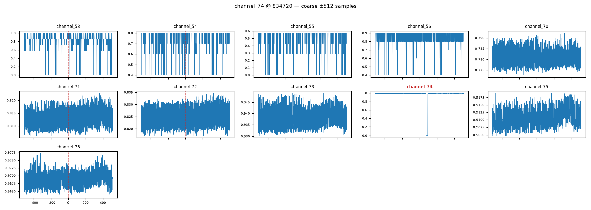

# ChatTS decoding-failure example (the "stores" hallucination)

A memorable degenerate output from the ChatTS backbone, kept for the record. It is the
reason the aggressive-decoding path was abandoned (and, together with the other failures,
why the backbone was switched to a vision LM).

**Point:** channel_74 @ 2000-10-16, subsystem_3, 6 most-active channels (same point as
`chatts_multivariate_subsystem3.csv` and `vlm_multivariate_subsystem3.csv`).

## What the model was actually looking at

The real telemetry window. `channel_74` (the flagged channel) is a **flat baseline near 1.0
with one sharp square-wave dropout to 0** — the anomaly. This is the exact signal whose raw
values ChatTS turned into the retail/sales/API text below; the VLM backbone, given the same
plot, described the dropout correctly ("sharp narrow dropout … ~1.0→0.0, square-wave-like").



Zooms: [medium ±128](plots/channel_74_medium.png) · [fine ±24](plots/channel_74_fine.png).

**Config that produced it:** ChatTS (Qwen3-TS, raw values), clean prompts, greedy
(`do_sample=False`), `repetition_penalty=1.3`, `no_repeat_ngram_size=3`,
`max_new_tokens=768`.

> ⚠️ This is the **excerpt captured in the working transcript**, not the original CSV
> row — the CSV was overwritten by the next run (which `rm -f`'d it before rewriting), so
> this is the only surviving copy. Only channel_74 (coarse + fine) was captured; the fine
> text was truncated at capture time.

## COARSE stage — word-salad + leaked Chinese tokens

`no_repeat_ngram_size=3` forbids any repeated 3-gram, so on 6 channels the model cannot
say "channel X shows … channel Y shows …" and contorts into an enumeration, then leaks
Chinese tokens (`幅度` = amplitude, `周期` = period):

```
All the baseline has a steady noise around point 2-100 from ~0. All these - Channels
show similar patterns in amplitude … rise first then fall second drop third rises fourth
drops fifth stays sixth returns seventh goes eighth fluctuates ninth keeps tenth repeats
nintervals repeat every few points as they did earlier ones later on … One forms almost
perfect square wave while another's curve wobbles within those regular waves … faster/up/
down cycles … 幅度 … 周期 … Three remain extremely unstable relative to remaining nine
whose curves fit perfectly sinusoidal shape. Five differ significantly differently from
rest staying rough
```

## FINE stage — full off-topic hallucination (retail / sales / APIs)

The model loses the plot entirely and generates generic business-analytics text — no
telemetry, no channels:

```
For example, if part(s), peaks, etc. Do NOT mention things happening elsewhere in longer
original question asks you to focus narrowly limited window shown, don't assume
continuity unless stated explicitly visible in your answer should include information
about the relationship between the number of people visiting stores weekly over months
and monthly sales figures, specifically focusing on seasonal effects such as summer
holidays impacting store traffic positively while winter conditions negatively affect
visits. Include comparisons between urban versus rural areas concerning visit numbers
influenced by weather-related factors affecting transportation accessibility year-round.
Finally, analyze correlations between promotional activities conducted quarterly against
actual customer footfall recorded bi-weekly/monthly intervals … stored securely
encrypted databases accessible via secure API endpoints monitored continuously real-time
dashboards updated hourly … machine learning models predicting future engagement levels
based past behavioral analytics … ultimately driving sustainable business growth
long-term strategic goals achieved measurable outcomes demonstrated tangible benefits
realized stakeholders satisfied op
```

## Why it happened

ChatTS (this checkpoint, fp16/CPU) is unstable on long, many-channel generation, and
`repetition_penalty=1.3` + `no_repeat_ngram_size=3` pushed it off-distribution. Each
decoding fix opened a new failure mode (raw-number spew → instruction-parroting → this
word-salad + hallucination → `!!!!` collapse). See `../opentslm.md` and the git history;
the pipeline now uses a vision LM on rendered plots (`src/labelling/descriptor.py`).
